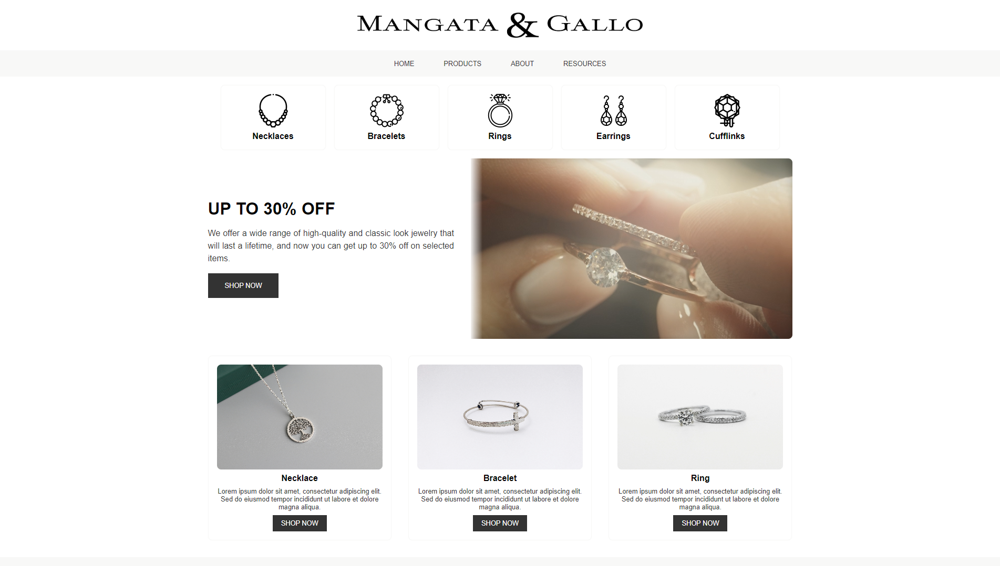

# 💎 Luxury Jewelry: Mangata and Gallo

Mangata and Gallo is a jewelry store that specializes in special occasions like engagements, weddings and anniversaries.

Final project for the [Coursera+Meta](https://www.coursera.org/learn/html-and-css-in-depth) course "HTML and CSS in depth".

<p align="center">
  
  <span>Project Interface</span>
</p>

<p align="center">
  
  
  
  
</p>

## 📚 About the Project

Mangata and Gallo is a jewelry store that specializes in special occasions like engagements, weddings and anniversaries. The jewelry company primarily operates online and has a small storefront in Austin, Texas with an atelier attached for browsing. Mangata & Gallo's selection of jewelry is known for its high-quality and classic look. The owner, an Austin local, is well known for her jewelry designs.  

Mariana is the owner and the lead designer of Mangata and Gallo. After graduating from design school with a specialization in diamond cutting and metal smithing, Mariana opened a store in her hometown, Austin and started to grow her business online. Mariana has always managed every aspect of the business, from jewelry design to marketing to e-commerce. However, she recently hired several artisans to help craft her designs and a young employee to help manage the company website and social media accounts.

## 💻 Technologies

* [HTML](https://developer.mozilla.org/en-US/docs/Web/HTML)
* [CSS](https://developer.mozilla.org/en-US/docs/Web/CSS)

## 🏃 Getting Started

First, clone this repository and access the created folder:

```bash
# Cloning repository
git clone https://github.com/iamtheluiz/mangata-and-gallo-portfolio-project.git

cd mangata-and-gallo-portfolio-project/
```

Open index.html in your browser and you will see the project running.

## 💼 Authors

* **Luiz Gustavo** - *Development* - [iamtheluiz](https://github.com/iamtheluiz)
  * Website: https://iamtheluiz.github.io
  * Github: [@iamtheluiz](https://github.com/iamtheluiz)
  * LinkedIn: [Luiz Gustavo da Silva Vasconcellos](https://www.linkedin.com/in/luiz-gustavo-da-silva-vasconcellos-05192a192?lipi=urn%3Ali%3Apage%3Ad_flagship3_profile_view_base_contact_details%3BbQkVQ3sTTv6XCn%2FiToGGcA%3D%3D)
